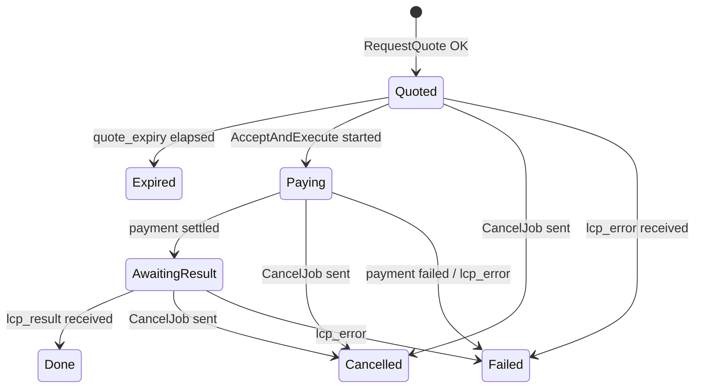
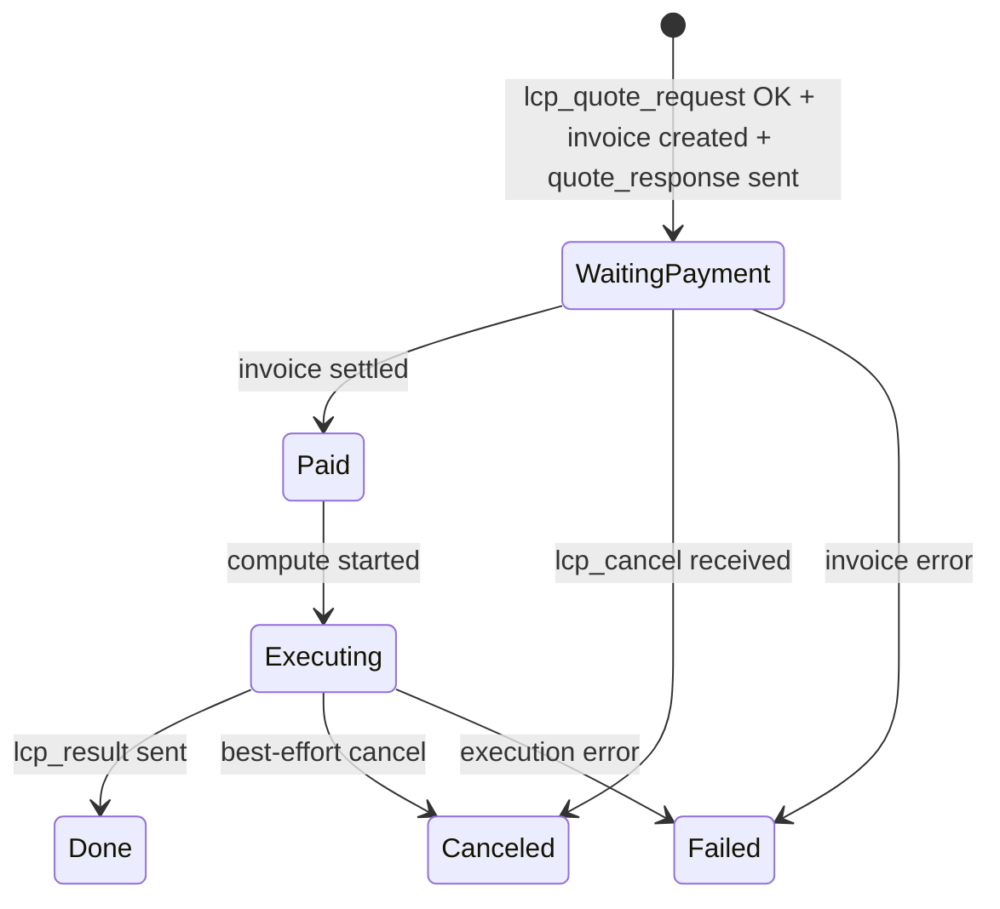

# spec.md — go-lcpd (Lightning Compute Protocol Daemon)

This document is the implementation specification (single source of truth) for `go-lcpd/` in this repository.
It is written in WYSIWID format (Concepts + Synchronizations).

Sources of truth:

- gRPC API: `go-lcpd/proto/lcpd/v1/lcpd.proto`
- LCP wire protocol: `protocol/protocol.md` (LCP v0.1, `protocol_version=1`)

go-lcpd exchanges LCP messages (TLV streams) with peers over `lnd` BOLT #1 custom messages as the transport.
It exposes a gRPC API (`lcpd.v1.LCPDService`) for local clients to drive the requester-side LCP flow (quote → pay → result).
The same process can also run as a provider-side handler (when configured) to process inbound `lcp_quote_request` and return an invoice and `lcp_result`.
It does not implement its own P2P (TCP) transport.

Protobuf is managed via `buf`. The goal is to keep the following integration tests reproducible within this project:

- gRPC: smoke check `GetLocalInfo` / `ListLCPPeers` (no external processes)
- Lightning (custom messages, regtest): two nodes exchange `lcp_manifest` and `ListLCPPeers` can enumerate LCP-capable peers (opt-in)
- Lightning (LCP provider, regtest): complete inbound `lcp_quote_request` → invoice → `lcp_result` over custom messages (opt-in)
- Lightning (LCP requester, regtest): receive `lcp_result` via `RequestQuote` → `AcceptAndExecute` (opt-in)

## Security & Architectural Constraints

These constraints are system invariants.

- Do not modify BOLTs: Do not propose or require changes to Lightning BOLT specs (L2). Rationale: preserve interoperability.
- Do not implement a custom P2P (TCP) transport: go-lcpd MUST NOT implement peer transport over TCP/UDP. Delegate peer messaging to `lnd` peer connections. Rationale: avoid re-implementation and reduce operational risk.
- LCP message types MUST match `protocol/protocol.md`: Type numbers for `lcp_manifest`, etc. MUST follow the odd assignments in `protocol/protocol.md`. Rationale: coexistence with non-LCP peers.
- BOLT #1 unknown message rule: Ignore unknown odd messages. Disconnect on unknown even messages via `lnrpc.Lightning.DisconnectPeer`. Rationale: match BOLT #1 parity behavior.

- Enforce `protocol_version=1`: LCP v0.1 uses `protocol_version=1` (encoding: `major*100 + minor`). Implementations MUST send and accept only version 1. Rationale: interoperability.
- Preserve TLV stream canonical form: Encode TLVs as `bigsize(type)` → `bigsize(length)` → `value`. Sort by type. Do not duplicate types. Rationale: byte-exact `terms_hash` and forward compatibility.
- Do not disconnect on unknown TLVs: Unknown TLVs MUST NOT cause disconnection. Continue decoding. Rationale: forward compatibility.
- `llm_chat_params_tlvs` is strict: Providers MUST reject unknown param types with `lcp_error(code=unsupported_params)`. Rationale: fixed interpretation of typed params.

- Always include job-scope envelope TLVs: All LCP messages except `lcp_manifest` MUST include `job_id`, `msg_id`, and `expiry` per `protocol/protocol.md`. Rationale: replay safety and idempotency.
- Ignore expired messages (Provider inbound): Providers MUST ignore inbound `lcp_quote_request` / `lcp_cancel` where `expiry < now`. Rationale: replay resistance.
- Clamp envelope expiry window (Provider inbound): Providers MUST use `effective_expiry = min(expiry, now + MAX_ENVELOPE_EXPIRY_WINDOW_SECONDS)` per `protocol/protocol.md`. Rationale: prevent state-holding DoS via far-future `expiry`.
- Ignore duplicate messages (Provider inbound): Providers MUST de-duplicate inbound `lcp_quote_request` / `lcp_cancel` by (`peer_pubkey`, `job_id`, `msg_id`) until `effective_expiry`. Rationale: idempotency.

- LCP v0.1 `terms_hash`: Compute `terms_hash` byte-exactly as defined in `protocol/protocol.md`. Rationale: invoice binding depends on byte-exactness.
- Provider execution rule: Providers MUST NOT execute or deliver results for `job_id` before invoice settlement. Rationale: `protocol/protocol.md` execution rule.
- Requester invoice checks: Before paying, verify `description_hash == terms_hash`, `payee_pubkey == peer_id`, `invoice_amount_msat == price_msat`, and `invoice_expiry_unix <= quote_expiry` (with `ALLOWED_CLOCK_SKEW_SECONDS`). Rationale: invoice swapping defense and amount/expiry integrity.
- Do not pay past quote expiry: Reject Terms where `quote_expiry <= now`. Rationale: avoid unnecessary payments.

- Default constants: Use these defaults unless configured:
  - `MAX_ENVELOPE_EXPIRY_WINDOW_SECONDS = 600`
  - `ALLOWED_CLOCK_SKEW_SECONDS = 5`
  - `DEFAULT_MAX_STORE_ENTRIES = 1024` (for `ReplayStore`, `ProviderJobStore`, and `RequesterJobStore`)
- Defaults override env vars:
  - `LCP_MAX_ENVELOPE_EXPIRY_WINDOW_SECONDS`
  - `LCP_ALLOWED_CLOCK_SKEW_SECONDS`
  - `LCP_DEFAULT_MAX_STORE_ENTRIES`
  - `LCP_INVOICE_EXPIRY_SLACK_SECONDS` (optional; defaults to `LCP_ALLOWED_CLOCK_SKEW_SECONDS`)

- Payload limit checks: Do not send `lcp_quote_request` (gRPC `RequestQuote`) or `lcp_result` (Provider) if it exceeds `remote_manifest.max_payload_bytes`. gRPC returns `RESOURCE_EXHAUSTED`. Provider returns `lcp_error(code=payload_too_large)`. Rationale: DoS resistance and compatibility.

- Prefer regtest for Lightning integration: Development/integration tests MUST use regtest. They MUST NOT depend on mainnet/testnet. Rationale: safety and reproducibility.
- Do not implicitly require external processes: `go test ./...` MUST NOT require `bitcoind` or `lnd`. Lightning integration tests MUST be opt-in. Rationale: developer experience and safety.
- Integration tests MUST NOT depend on external networks: CI/dev MUST not require external APIs. Keep smoke tests opt-in. Rationale: reproducibility.

- Do not log secrets: By default, logs MUST NOT contain API keys, access tokens, raw prompts, or raw model outputs. Rationale: logs leak.
- Primary interface is gRPC: go-lcpd MUST be operable via gRPC. Do not make CLI the primary interface. Rationale: stabilize an API shape for integrations.
- Do not provide `cmd/`: go-lcpd MUST NOT provide CLI entry points under `go-lcpd/cmd/*`. Rationale: keep operations centered on gRPC.
- Manage protobuf with buf: API protobufs MUST be generated via `buf`. Rationale: change detection, compatibility, reproducible generation.
- DI and lifecycle: Go components MUST be wired with `go.uber.org/fx`. Rationale: explicit composition and testability.
- Do not assume Nix: Core workflows SHOULD work with a standard Go toolchain and externally installed binaries. `flake.nix` MAY exist as an optional pinned devShell. Rationale: onboarding.

## Concepts

### ProtocolCompatibility
Purpose: Provide LCP-compatible core primitives that remain stable across protocol versions.
Domain Model:
* `ProtocolVersion`: uint16 (const 2)
* `JobID`: 32 bytes
* `TermsCore`: `protocol_version`, `job_id`, `price_msat`, `quote_expiry_unix_seconds`, `task_kind`, `input_hash32`, `params_hash32`
* `TermsHash`: 32 bytes (SHA256)
Actions:
* `new_job_id() -> job_id`
* `compute_terms_hash(terms_core) -> terms_hash`
Operational Principle:
* `terms_hash` MUST be computed exactly as `protocol/protocol.md` defines (canonical TLV encoding + SHA256).
* `terms_hash` MUST be computed only from `protocol_version(u16)` / `job_id(32 bytes)` / `price_msat(tu64)` / `quote_expiry(tu64)` / `task_kind(byte)` / `input_hash(32 bytes)` / `params_hash(32 bytes)` (do not include `payment_request`, etc.).
* The gRPC API represents `quote_expiry` as `google.protobuf.Timestamp`.
  `terms_hash` uses only `quote_expiry.seconds` (Unix epoch seconds). Nanos are always 0.

### LCPTasks
Purpose: Provide strict task definitions from `go-lcpd/proto/lcpd/v1/lcpd.proto` and pin down the mapping to the wire format.
Domain Model:
* `LCPTaskKind`: `LCP_TASK_KIND_UNSPECIFIED` | `LCP_TASK_KIND_LLM_CHAT`
* `Task`: `oneof spec` (currently only `LLMChatTaskSpec`)
* `LLMChatTaskSpec`: prompt(string), params(LLMChatParams)
* `LLMChatParams`: profile(string), temperature_milli(uint32), max_output_tokens(uint32)
Actions:
* `validate_task(task) -> ok | error`
* `to_wire_quote_request_task(task) -> task_kind(string), input([]byte), params_bytes([]byte) | error`
Operational Principle:
* This implementation supports only `llm.chat` and MUST reject everything else.
* `LLMChatTaskSpec.prompt` MUST NOT be empty.
* `LLMChatParams.profile` MUST NOT be empty.
* Wire mapping (`protocol/protocol.md`):
  * `task_kind = "llm.chat"`
  * `input = UTF-8(prompt)`
  * `params = llm_chat_params_tlvs` (must include at least `profile`)
* In proto, `temperature_milli` / `max_output_tokens` treat 0 as "unset". On the wire, omit those TLVs from `llm_chat_params_tlvs` (to align with proto3 presence semantics).

### LCPWire
Purpose: Encode/decode the LCP wire messages (TLV streams) defined in `protocol/protocol.md`.
Domain Model:
* `MessageType`: `lcp_manifest(42081)` / `lcp_quote_request(42083)` / `lcp_quote_response(42085)` / `lcp_result(42087)` / `lcp_cancel(42095)` / `lcp_error(42097)`
* `JobEnvelope`: protocol_version(uint16), job_id(32 bytes), msg_id(32 bytes), expiry(uint64)
* `Manifest`: protocol_version, max_payload_bytes(*uint32), supported_tasks([]TaskTemplate)
* `TaskTemplate`: task_kind(string), params_bytes(*[]byte), llm_chat_params(*LLMChatParams)
* `QuoteRequest`: envelope, task_kind(string), input([]byte), params_bytes(*[]byte), llm_chat_params(*LLMChatParams)
* `QuoteResponse`: envelope, price_msat(uint64), quote_expiry(uint64), terms_hash(32 bytes), payment_request(string)
* `Result`: envelope, result([]byte), content_type(*string)
* `Cancel`: envelope, reason(*string)
* `Error`: envelope, code(uint16), message(*string)
* `LLMChatParams`: profile(string), temperature_milli(*uint32), max_output_tokens(*uint32), unknown(map[uint64][]byte)
Actions:
* `encode_manifest(m) -> payload_bytes | error`
* `decode_manifest(payload_bytes) -> manifest | error`
* `encode_quote_request(q) -> payload_bytes | error`
* `decode_quote_request(payload_bytes) -> quote_request | error`
* `encode_quote_response(q) -> payload_bytes | error`
* `decode_quote_response(payload_bytes) -> quote_response | error`
* `encode_result(r) -> payload_bytes | error`
* `decode_result(payload_bytes) -> result | error`
* `encode_cancel(c) -> payload_bytes | error`
* `decode_cancel(payload_bytes) -> cancel | error`
* `encode_error(e) -> payload_bytes | error`
* `decode_error(payload_bytes) -> lcp_error | error`
* `encode_llm_chat_params(p) -> params_bytes | error`
* `decode_llm_chat_params(params_bytes) -> params | error`
Operational Principle:
* Treat `lcp_manifest` as connection-scoped (do not include job envelope TLVs).
* Job-scope messages (everything except `lcp_manifest`) MUST include `JobEnvelope` (`protocol_version`, `job_id`, `msg_id`, `expiry`).
* `llm_chat_params_tlvs` MUST preserve unknown TLVs in `unknown` and MUST NOT fail decoding solely due to unknown TLVs (forward compatibility).

### LCPMessageRouter
Purpose: Classify inbound custom messages into known LCP message types and apply the BOLT #1 parity rule for unknown message types.
Domain Model:
* `CustomMessage`: peer_pubkey, msg_type(uint16), payload_bytes
* `RouteDecision`: action(dispatch_manifest|dispatch_quote_request|dispatch_quote_response|dispatch_result|dispatch_cancel|dispatch_error|ignore|disconnect), reason
Actions:
* `route(custom_message) -> decision`
Operational Principle:
* LCP v0.1 message types follow the assignments in `protocol/protocol.md` (all odd).
* Unknown odd is ignored; unknown even triggers disconnect (BOLT #1 parity rule).
* `route` does not decode the payload (classification only).

### ReplayStore
Purpose: Provide idempotency (de-duplication) and replay safety for job-scope messages.
Domain Model:
* `ReplayKey`: peer_pubkey, job_id(32 bytes), msg_id(32 bytes)
* `ReplayEntry`: key, expiry(uint64)
Actions:
* `check_and_remember(key, effective_expiry, now) -> ok | duplicate | expired`
* `prune(now) -> void`
Operational Principle:
* Messages with `expiry < now` MUST be treated as `expired` and ignored (`protocol/protocol.md`).
* `duplicate` entries MUST be retained until `effective_expiry` (de-dup at least until `effective_expiry`).
* The store MUST be pruned by TTL and MUST have bounds (e.g., max entries) to cap memory usage.
* Default bounds MUST be `DEFAULT_MAX_STORE_ENTRIES = 1024`.

### ProviderJobStore
Purpose: Hold Provider-side job state (quote/payment/execute) to support idempotency and cancellation.
Domain Model:
* `JobKey`: peer_pubkey, job_id
* `JobState`: quoted | waiting_payment | paid | executing | done | canceled | failed
* `Job`: peer_pubkey, job_id, state, quote_expiry, terms_hash, payment_hash, invoice_add_index, quote_response, created_at
Actions:
* `get(job_key) -> job | not_found`
* `upsert(job) -> void`
* `update_state(job_key, state) -> void`
* `set_quote_response(job_key, quote_response) -> void`
* `set_payment_hash(job_key, payment_hash) -> void`
Operational Principle:
* Since `job_id` can collide across peers, jobs MUST be keyed by `peer_pubkey` as well.
* The store MUST have bounds (e.g., max entries) and MUST NOT retain pending state past `quote_expiry` (evict/GC). Rationale: prevent state-holding DoS via unbounded job creation.
* Default bounds MUST be `DEFAULT_MAX_STORE_ENTRIES = 1024`.

### ComputeBackend
Purpose: Execute `llm.chat` on the Provider side and produce output bytes.
Domain Model:
* `Task`: task_kind(string), model(string), input_bytes([]byte), params_bytes([]byte)
* `ExecutionResult`: output_bytes([]byte), usage
Actions:
* `execute(ctx, task) -> execution_result | error`
Operational Principle:
* In integration tests, `execute` MUST be a deterministic stub/dummy implementation (connectivity and reproducibility come first).
* For `task_kind="llm.chat"`, `input_bytes` is treated as a single UTF-8 prompt string.
* For `task_kind="llm.chat"`, `task.model` is the backend model ID (resolved from the LCP `profile` via Provider config).
* `output_bytes` SHOULD be returned as UTF-8 response text.

### LLMExecutionPolicy
Purpose: Control `llm.chat` execution parameters (especially max output tokens) to ensure DoS resistance and determinism.
Domain Model:
* `ExecutionPolicy`: max_output_tokens(uint32)
Actions:
* `apply(task) -> planned_task | error`
Operational Principle:
* The Provider MUST NOT pass request `max_output_tokens` / `temperature_milli` directly to the backend (fixed by server-side policy).
* `planned_task.params_bytes` MUST be UTF-8 JSON suitable for an OpenAI-compatible API and MUST include at least `{ "max_output_tokens": <value> }`.
* `planned_task.params_bytes` MAY include additional OpenAI-compatible fields (e.g., `temperature`, `top_p`, `stop`, `presence_penalty`, `frequency_penalty`, `seed`) sourced from Provider-side config.
* `apply` MUST reject any request where `task.params_bytes` is already non-empty (policy is the sole request params source).

### LLMUsageEstimator
Purpose: Estimate `llm.chat` token usage during quoting to drive pricing decisions.
Domain Model:
* `UsageEstimate`: input_tokens(uint64), max_output_tokens(uint64), total_tokens(uint64)
* `Estimation`: usage, resources([]ResourceEstimate), estimator_id(string)
* `ResourceEstimate`: name(string), amount(uint64)
Actions:
* `estimate(task, policy) -> estimation | error`
Operational Principle:
* Token estimation uses `approx.v1`: `input_tokens = ceil(len(input_bytes)/4)`, `max_output_tokens = policy.max_output_tokens`.
* `task_kind!="llm.chat"` MUST be rejected.

### LLMPricing
Purpose: Compute `price_msat` from estimated token usage on the Provider side.
Domain Model:
* `PriceTableEntry`: profile(string), input_msat_per_mtok(uint64), cached_input_msat_per_mtok(*uint64), output_msat_per_mtok(uint64)
* `PriceTable`: map[profile]PriceTableEntry
* `PriceBreakdown`: input_tokens, cached_input_tokens, output_tokens, price_msat(uint64)
Actions:
* `quote_price(profile, usage_estimate, cached_input_tokens, price_table) -> price_breakdown | error`
Operational Principle:
* Prices are computed from a table in units of "msat per 1M tokens", rounding up (ceil).
* Unknown profiles MUST be rejected.
* Overflows MAY be treated as equivalent to `rate_limited`.

### LCPProvider
Purpose: Act as an LCP v0.1 Provider: process job-scope messages and complete quote → payment → result.
Domain Model:
* `ProviderConfig`: enabled(bool), quote_ttl_seconds(uint64), llm_chat_profiles(map[profile]LLMChatProfile)
* `ProviderRuntime`: execution_policy(ExecutionPolicy), usage_estimator(LLMUsageEstimator)
* `LLMChatProfile`: backend_model(string), max_output_tokens(*uint32), price(PriceTableEntry), openai_params(OpenAIChatParams)
* `OpenAIChatParams`: temperature(*float64), top_p(*float64), stop([]string), presence_penalty(*float64), frequency_penalty(*float64), seed(*int64)
Actions:
* `handle_quote_request(peer_pubkey, quote_request, now) -> (quote_response | lcp_error)`
* `handle_cancel(peer_pubkey, cancel, now) -> void`
Operational Principle:
* Provider mode MUST be explicitly enabled (`lcpd-grpcd` requires `enabled: true` in the YAML at `LCPD_PROVIDER_CONFIG_PATH`).
* If Provider is disabled (or the compute backend is disabled), inbound `lcp_quote_request` MUST be rejected as `lcp_error(code=unsupported_task)` (do not create invoices or execute).
* The Provider MUST decode `lcp_quote_request` and validate `protocol_version` and the task (unsupported cases return `lcp_error`).
* `llm.chat` params are strict: if unknown TLV types are present, return `lcp_error(code=unsupported_params)`.
* If `llm_chat_profiles` is non-empty, requests whose `profile` is not in the set MUST be rejected as `lcp_error(code=unsupported_task)`.
* If `llm_chat_profiles` is empty, any `profile` MAY be accepted, but the manifest MUST NOT advertise `supported_tasks`.
* The Provider MUST de-duplicate inbound `lcp_quote_request` / `lcp_cancel` via `ReplayStore`, and drop messages where `expiry < now`.
* For multiple `lcp_quote_request` messages with the same `job_id`, the Provider SHOULD return the same `lcp_quote_response` within TTL (idempotency).
* If an existing job's `terms_hash` does not match the recomputed value, the Provider SHOULD return `lcp_error(code=payment_invalid)`.
* `price_msat` is computed via `LLMExecutionPolicy.apply` + `LLMUsageEstimator.estimate` + `LLMPricing.quote_price` (fixed at quote-time; do not recompute on settlement).
* The Provider MUST compute `terms_hash` and MUST set the BOLT11 invoice `description_hash` to exactly equal `terms_hash` (invoice swapping defense).
* The Provider MUST NOT start execution before invoice settlement.
* When executing, the Provider MUST map `profile -> backend_model` and pass `backend_model` to the compute backend.
* `lcp_result.result_bytes` is UTF-8, and for `llm.chat` the Provider SHOULD set `content_type` to `text/plain; charset=utf-8`.
* If the remote declares `max_payload_bytes`, and the `lcp_result` payload would exceed it, the Provider SHOULD return `lcp_error(code=payload_too_large)` (no chunking).
* The send payload size for `lcp_quote_response` / `lcp_error` is not explicitly checked (assumed small).

### RequesterJobStore
Purpose: Hold job state between gRPC `RequestQuote` and `AcceptAndExecute`.
Domain Model:
* `Job`: peer_id, job_id, task, terms, state, created_at, updated_at
* `JobState`: quoted | paying | awaiting_result | done | cancelled | failed | expired
Actions:
* `put_quote(peer_id, task, terms) -> void`
* `get_terms(peer_id, job_id) -> terms | error`
* `mark_state(peer_id, job_id, state) -> void`
* `gc() -> void`
Operational Principle:
* Jobs past `quote_expiry` MUST be treated as `expired`.
* The store MUST have bounds (e.g., max entries) and MUST evict/GC expired jobs. Rationale: prevent local state growth under repeated `RequestQuote`.
* `JobStore` MAY be an in-process memory implementation.
* Default bounds MUST be `DEFAULT_MAX_STORE_ENTRIES = 1024`.

### RequesterWaiter
Purpose: Deliver inbound `lcp_quote_response` / `lcp_result` / `lcp_error` to the corresponding waiting gRPC calls.
Domain Model:
* `Key`: peer_id, job_id
* `QuoteOutcome`: quote_response(*QuoteResponse) | error(*Error)
* `ResultOutcome`: result(*Result) | error(*Error)
Actions:
* `wait_quote_response(ctx, peer_id, job_id) -> QuoteOutcome | error`
* `wait_result(ctx, peer_id, job_id) -> ResultOutcome | error`
* `handle_inbound_custom_message(peer_pubkey, msg_type, payload_bytes) -> void`
Operational Principle:
* Inbound payloads are decoded via `LCPWire.decode_quote_response` / `decode_result` / `decode_error`.
* For the same (peer_id, job_id), allow at most one concurrent waiter for quote/result; additional waiters must fail.
* `lcp_error` is delivered to both the quote and result waiters.
* The requester-side waiter does not implement expiry/replay filtering.

### PeerDirectory
Purpose: Track connected peers and their LCP readiness (via `lcp_manifest`), and provide `list_lcp_peers()`.
Domain Model:
* `PeerID`: string (Lightning pubkey hex, `lnrpc.Peer.pub_key`)
* `Peer`: peer_id, address, connected, custom_msg_enabled, lcp_ready, remote_manifest
Actions:
* `upsert_peer(peer_id, address) -> void`
* `mark_connected(peer_id) -> void`
* `mark_disconnected(peer_id) -> void`
* `mark_custom_msg_enabled(peer_id, enabled) -> void`
* `mark_lcp_ready(peer_id, remote_manifest) -> void`
* `list_lcp_peers() -> []Peer`
* `remote_manifest_for(peer_id) -> manifest | not_found`
Operational Principle:
* `list_lcp_peers()` returns only peers that are connected, have `custom_msg_enabled=true`, and have responded with `lcp_manifest`.

### LNDPeerMessaging
Purpose: Send/receive BOLT #1 custom messages over lnd peer connections, and observe peer online/offline and inbound messages.
Domain Model:
* `LNDConnection`: rpc_addr, tls_cert_path, admin_macaroon_path
* `InboundCustomMessage`: peer_pubkey, msg_type(uint16), payload_bytes
Actions:
* `dial(conn) -> grpc_conn | error`
* `list_peers(grpc_conn) -> []PeerSnapshot | error`
* `subscribe_peer_events(grpc_conn) -> stream<PeerEvent> | error`
* `subscribe_custom_messages(grpc_conn) -> stream<CustomMessage> | error`
* `send_custom_message(grpc_conn, peer_pubkey, msg_type, payload_bytes) -> ok | error`
* `disconnect_peer(grpc_conn, peer_pubkey) -> ok | error`
Operational Principle:
* `lcp_manifest` MUST be sent at most once per connection (to avoid infinite loops).
* If `lcp_manifest` is received and we have not sent ours yet, reply once (SHOULD).
* Inbound messages are classified via `LCPMessageRouter`; manifests are decoded internally and applied to `PeerDirectory`.

### LightningRPC
Purpose: Provide minimal invoice operations via the lnd gRPC API (create/verify/pay).
Domain Model:
* `PaymentRequest`: string (BOLT11)
* `PayeePubKey`: string (invoice destination pubkey hex; `DecodePayReq.destination`)
* `DescriptionHash`: 32 bytes
* `PaymentHash`: 32 bytes (`AddInvoiceResponse.r_hash`)
* `InvoiceAddIndex`: uint64 (`AddInvoiceResponse.add_index`)
* `PaymentPreimage`: 32 bytes
Actions:
* `get_info() -> info | error`
* `create_invoice(description_hash, price_msat, expiry_seconds) -> payment_request, payment_hash, add_index | error`
* `wait_for_settlement(payment_hash, add_index) -> ok | error`
* `decode_payment_request(payment_request) -> description_hash, payee_pubkey | error`
* `pay_invoice(payment_request) -> payment_preimage | error`
Operational Principle:
* Providers MUST create invoices with `description_hash=terms_hash`.
* Before paying, the Requester MUST verify `description_hash==terms_hash` and `payee_pubkey==peer_id`.

### GRPCService
Purpose: Provide the gRPC API for operating go-lcpd.
Domain Model:
* `Proto`: `go-lcpd/proto/lcpd/v1/lcpd.proto` (managed by buf)
* `Service`: `lcpd.v1.LCPDService`
* `RPC`: `ListLCPPeers` / `GetLocalInfo` / `RequestQuote` / `AcceptAndExecute` / `CancelJob`
Actions:
* `ListLCPPeers(request) -> response`
* `GetLocalInfo(request) -> response`
* `RequestQuote(request) -> response`
* `AcceptAndExecute(request) -> response`
* `CancelJob(request) -> response`
Operational Principle:
* The protobuf schema is the API contract; do not expose Go internal domain types directly.
* Invalid input returns a gRPC status (e.g., `InvalidArgument`).
* `AcceptAndExecute` is a blocking call; clients SHOULD set a deadline.

### RegtestDevnet
Purpose: Provide a repo-local regtest devnet (Bitcoin Core + lnd) to reproduce Lightning integration locally (invoice binding / payments).
Domain Model:
* `Devnet`: data_dir, bitcoind_rpc_addr, lnd_nodes
* `LNDNode`: node_name, rpc_addr, tls_cert_path, admin_macaroon_path
Actions:
* `up() -> ok | error`
* `down() -> ok | error`
* `paths(node_name) -> LNDNode`
* `lncli(node_name, args...) -> stdout | error`
* `bitcoin_cli(args...) -> stdout | error`
Operational Principle:
* The devnet is started via `./scripts/devnet` and stores all state under `./.data/devnet/`.
* RPC must bind to localhost only.

## Synchronizations

### sync job_state_machine_requester
Summary: Define an intuitive state machine for a Requester job (via gRPC).
Diagrams:

### sync job_state_machine_provider
Summary: Define an intuitive state machine for a Provider job.
Diagrams:

### sync lnd_peer_messaging_startup
Summary: On startup, connect to lnd, load an initial peer snapshot, and start subscription loops.
When: on go-lcpd startup.
Then:
1. Connect to lnd via `LNDPeerMessaging.dial` (if not configured, disable integration and do nothing).
2. Fetch currently connected peers via `LNDPeerMessaging.list_peers` and apply them to `PeerDirectory` (connected + custom_msg_enabled).
3. For each peer, send `lcp_manifest` once if it has not been sent yet.
4. Start the `subscribe_peer_events` and `subscribe_custom_messages` loops.

### sync lnd_inbound_custom_message_dispatch
Summary: Classify inbound custom messages; apply manifests to `PeerDirectory`; dispatch the rest to handlers.
When: `LNDPeerMessaging` receives a `CustomMessage`.
Then:
1. Classify via `LCPMessageRouter.route`.
2. For `dispatch_manifest`, decode via `LCPWire.decode_manifest`, call `PeerDirectory.mark_lcp_ready`, and if we have not sent ours yet, reply with `lcp_manifest` once.
3. For `dispatch_quote_request` / `dispatch_cancel`, dispatch to the Provider handler (replay/expiry handling lives on the Provider handler side).
4. For `dispatch_quote_response` / `dispatch_result` / `dispatch_error`, dispatch to the requester-side waiter (bound to the waiting gRPC call).
5. For `disconnect`, call `DisconnectPeer`.
6. For `ignore`, do nothing.

### sync grpc_get_local_info
Summary: Return local `node_id` and `manifest` via `GetLocalInfo`.
When: `GRPCService.GetLocalInfo` is called.
Then:
1. Call `LightningRPC.get_info` and use `identity_pubkey` as `node_id`.
2. Build `manifest` from local config (`protocol_version=1`, `max_payload_bytes=16384`). Include `supported_tasks` only when Provider is enabled and `llm_chat_profiles` is non-empty.
3. Return `GetLocalInfoResponse{node_id, manifest}`.

### sync grpc_list_lcp_peers
Summary: Enumerate connected LCP-capable peers (those that have responded with `lcp_manifest`) via `ListLCPPeers`.
When: `GRPCService.ListLCPPeers` is called.
Then:
1. Call `PeerDirectory.list_lcp_peers()`.
2. Pack each peer's `peer_id` / `address` / `remote_manifest` into the gRPC response and return it.

### sync grpc_request_quote
Summary: Send `lcp_quote_request` via `RequestQuote` and return `lcp_quote_response` as `Terms`.
When: `GRPCService.RequestQuote` is called.
Where:
1. Gather and validate inputs (`peer_id`, `task`).
2. Precondition: the target peer is connected and `remote_manifest` has been received (otherwise return FAILED_PRECONDITION).
Then:
1. Call `LCPTasks.validate_task`.
2. Generate `job_id`, `msg_id`, and `expiry` (`expiry = now + 300 seconds`).
3. Build a `QuoteRequest` by calling `LCPTasks.to_wire_quote_request_task` to get `task_kind/input/params_bytes`.
4. If it would exceed the peer's `remote_manifest.max_payload_bytes`, return RESOURCE_EXHAUSTED (do not send).
5. Build payload via `LCPWire.encode_quote_request` and call `SendCustomMessage(type=42083)`.
6. Wait until deadline for `lcp_quote_response` or `lcp_error` with the same `job_id`.
7. On `lcp_quote_response`, recompute and verify `terms_hash`, call `RequesterJobStore.put_quote`, and return `RequestQuoteResponse{terms}`.

### sync grpc_accept_and_execute
Summary: Pay the invoice in `AcceptAndExecute`, wait for `lcp_result`, and return `Result`.
When: `GRPCService.AcceptAndExecute` is called.
Where:
1. Gather and validate inputs (`peer_id`, `job_id`, `pay_invoice`).
2. Precondition: `RequesterJobStore` has a quote for `job_id` (otherwise NOT_FOUND).
Then:
1. Verify `pay_invoice=true` (false is INVALID_ARGUMENT).
2. Verify `quote_expiry` has not passed (if it has, FAILED_PRECONDITION).
3. Call `LightningRPC.decode_payment_request(terms.payment_request)` and verify invoice binding (failure is FAILED_PRECONDITION):
   - `description_hash == terms.terms_hash`
   - `payee_pubkey == peer_id`
   - `invoice_amount_msat == price_msat`
   - `invoice_expiry_unix <= quote_expiry (+ ALLOWED_CLOCK_SKEW_SECONDS)`
4. Call `LightningRPC.pay_invoice`, then wait until deadline for `lcp_result` or `lcp_error` with the same `job_id`.
5. On `lcp_result`, reconstruct `Result` via `LCPWire.decode_result` and return `AcceptAndExecuteResponse{result}`.

### sync grpc_cancel_job
Summary: Send `lcp_cancel` via `CancelJob` (best-effort).
When: `GRPCService.CancelJob` is called.
Then:
1. Generate `msg_id` and `expiry` (`expiry = now + 300 seconds`).
2. Build payload via `LCPWire.encode_cancel` and call `SendCustomMessage(type=42095)`.
3. On success, return `CancelJobResponse{success=true}`.

### sync lnd_lcp_provider_quote_pay_result
Summary: As a Provider, receive `lcp_quote_request`, enforce invoice binding, wait for settlement, and return `lcp_result`.
When: the Provider handler receives `lcp_quote_request`.
Then:
1. If Provider is disabled or the compute backend is disabled, send `lcp_error(code=unsupported_task)` (do not create invoices or execute).
2. Validate `protocol_version`; if unsupported, send `lcp_error(code=unsupported_version)`.
3. Validate `task_kind` and `params`; if unsupported, send `lcp_error(code=unsupported_task|unsupported_params)`.
4. If `expiry < now`, drop; otherwise compute `effective_expiry = min(expiry, now + MAX_ENVELOPE_EXPIRY_WINDOW_SECONDS)` and de-duplicate via `ReplayStore` until `effective_expiry` (drop duplicates).
5. Set `quote_expiry = now + quote_ttl_seconds`, compute `price_msat` via `LLMExecutionPolicy.apply` / `LLMUsageEstimator.estimate` / `LLMPricing.quote_price`, then compute `terms_hash`.
6. Satisfy idempotency for the same `job_id`:
   - If `ProviderJobStore` already has a valid quote, re-send the same `lcp_quote_response`.
   - If it exists but is expired, send `lcp_error(code=quote_expired)`.
   - If the existing job's `terms_hash` mismatches, send `lcp_error(code=payment_invalid)`.
7. Call `create_invoice(description_hash=terms_hash, price_msat, expiry_seconds)` and obtain `payment_request`.
   - `expiry_seconds = max(1, quote_ttl_seconds - ALLOWED_CLOCK_SKEW_SECONDS)`
   - Rationale: ensure `invoice_expiry_unix <= quote_expiry (+ ALLOWED_CLOCK_SKEW_SECONDS)` on the requester side.
8. Encode and send `lcp_quote_response`, and persist it in `ProviderJobStore` (state `waiting_payment`).
9. Wait for settlement via `wait_for_settlement` (MUST NOT start execution before settlement).
10. After settlement, call `ComputeBackend.execute` and obtain output.
11. Encode `lcp_result`. If the remote declares `max_payload_bytes` and the payload would exceed it, send `lcp_error(code=payload_too_large)`; otherwise send `lcp_result`.

### sync lnd_lcp_provider_cancel
Summary: On receiving `lcp_cancel`, stop the job as much as possible.
When: the Provider handler receives `lcp_cancel`.
Then:
1. If `expiry < now`, drop; if duplicate by `ReplayStore`, drop.
2. If the job has not started, move `ProviderJobStore` to `canceled` and do no further work.
3. If the job is executing, attempt context cancellation and stop as much as possible (best-effort).

### sync integration_grpc_smoke
Summary: Ensure gRPC request/response works via an integration test (no external processes).
When: the integration test starts.
Then:
1. Server startup succeeds.
2. Verify `ListLCPPeers` returns a response (typically an empty list).
3. Verify `GetLocalInfo` returns UNAVAILABLE when `lnd` is not configured.

### sync integration_regtest_lnd_lcp_manifest_roundtrip
Summary: On regtest, show via an integration test (opt-in) that two nodes can exchange `lcp_manifest` over lnd custom messages.
When: the integration test starts with `LCP_ITEST_REGTEST=1`.
Then:
1. Start `bitcoind` and two `lnd` nodes and initialize wallets.
2. Connect the two nodes via `ConnectPeer` and ensure they are online (no channel required).
3. Start go-lcpd on both sides and begin `lnd_inbound_custom_message_dispatch`.
4. Wait (short timeout) until `ListLCPPeers` returns one peer.
5. Verify `peer_id` equals the remote pubkey and required fields like `remote_manifest.protocol_version==1` match expectations.

### sync integration_regtest_lnd_lcp_quote_pay_result_custom_messages
Summary: On regtest, show via an integration test (opt-in) that LCP v0.1 quote → payment → result completes over custom messages.
When: the integration test starts with `LCP_ITEST_REGTEST=1`.
Then:
1. Start `bitcoind` and two `lnd` nodes (Alice=Requester, Bob=Provider) and initialize wallets.
2. Open a channel from Alice → Bob (required to settle invoices).
3. Start go-lcpd on Bob and enable Provider flows `lnd_inbound_custom_message_dispatch` and `lnd_lcp_provider_quote_pay_result` (compute backend is a deterministic stub).
4. On Alice (the test Requester), send `lcp_quote_request` via `SendCustomMessage`.
5. Receive and decode `lcp_quote_response` via `SubscribeCustomMessages`, verify `description_hash == terms_hash` and `destination(payee) == bob_pubkey` via `DecodePayReq`, then pay.
6. Receive and decode `lcp_result` via `SubscribeCustomMessages` and verify it matches the expected output (use `cmp.Diff`).
